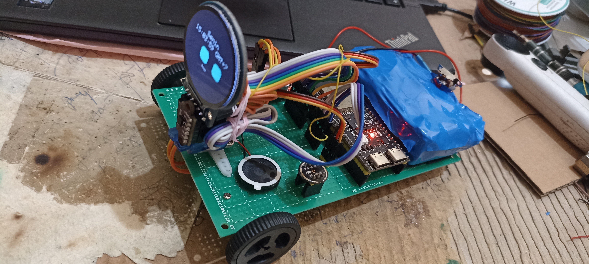
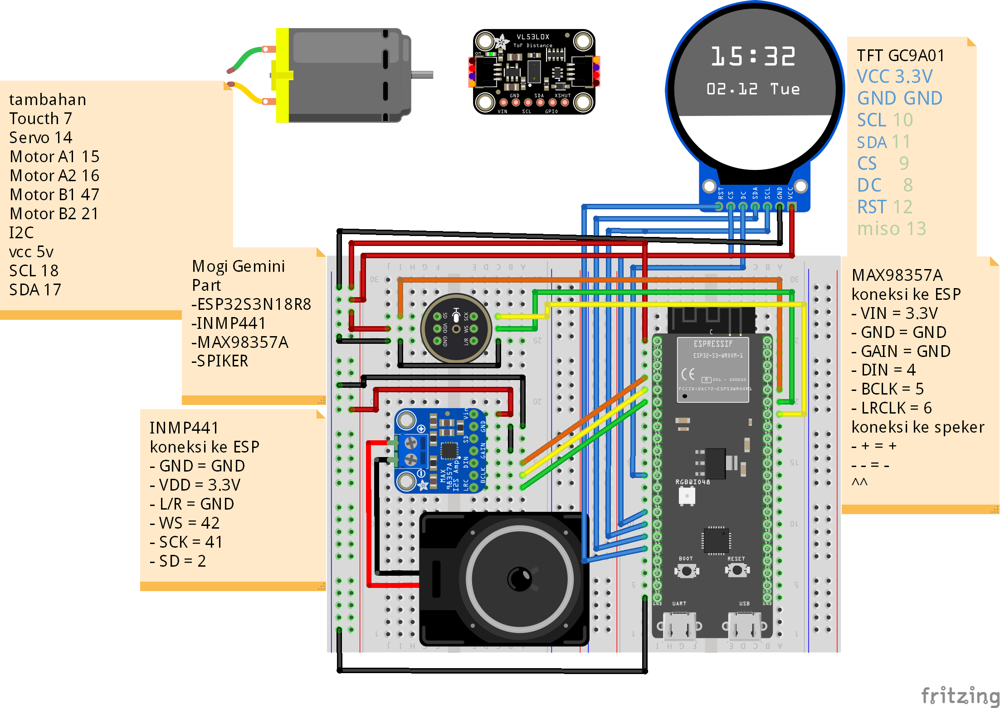
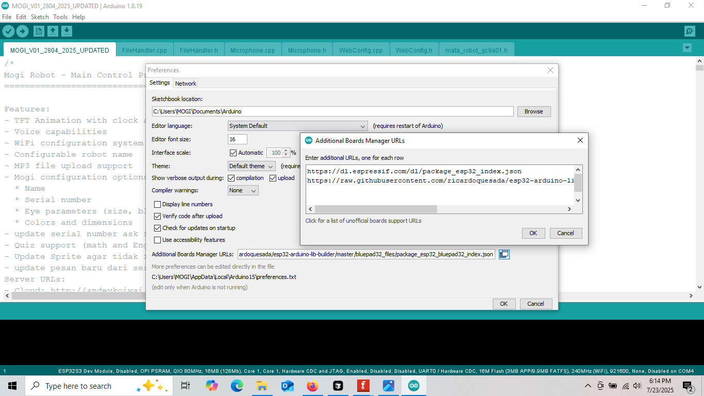
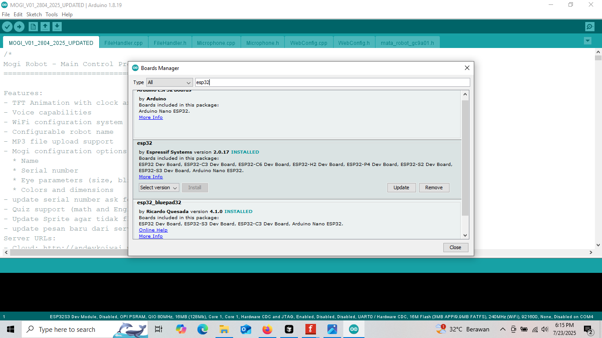
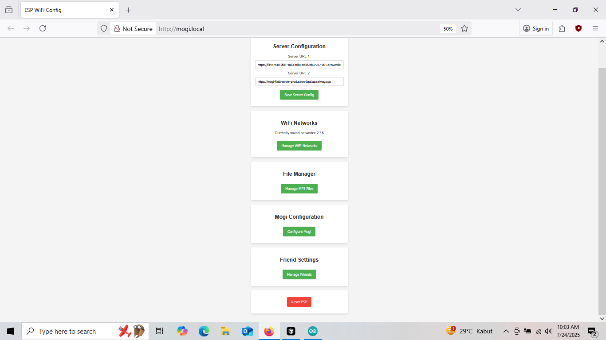
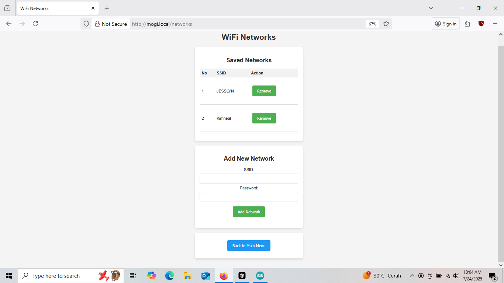
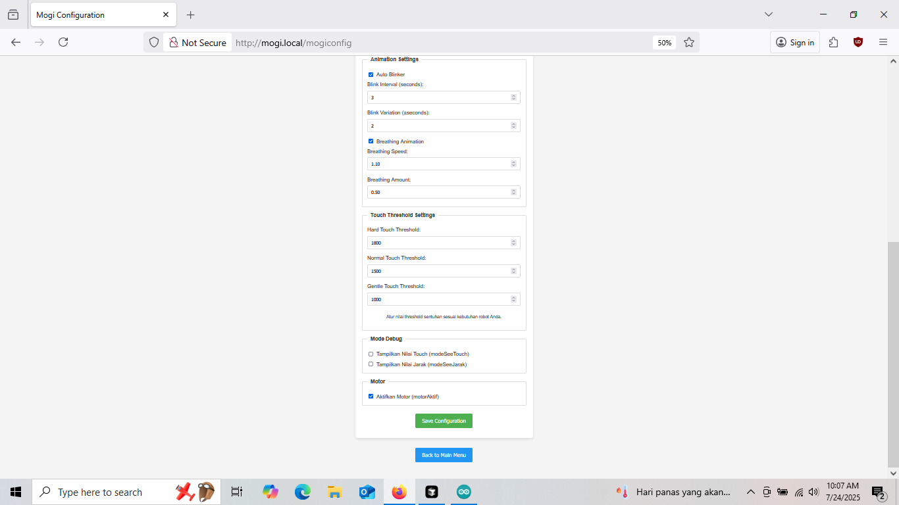
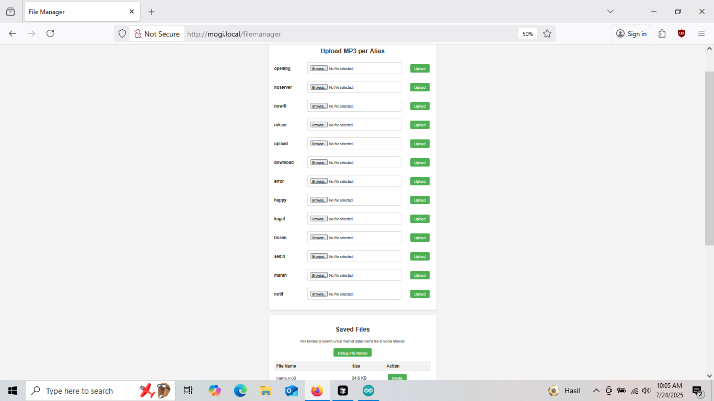
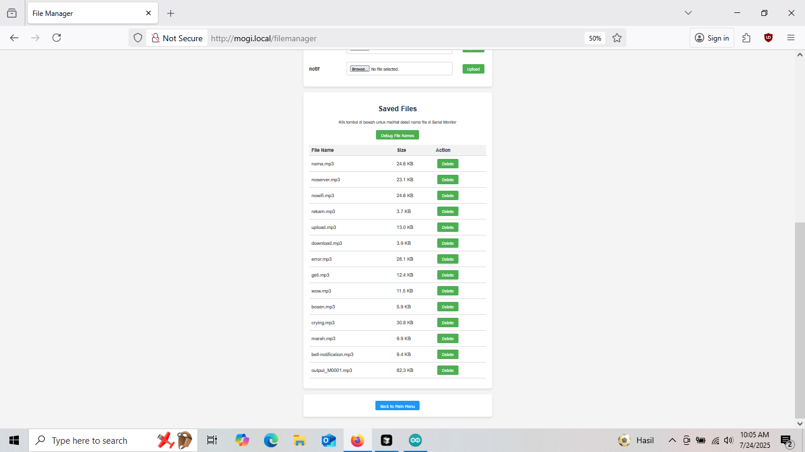
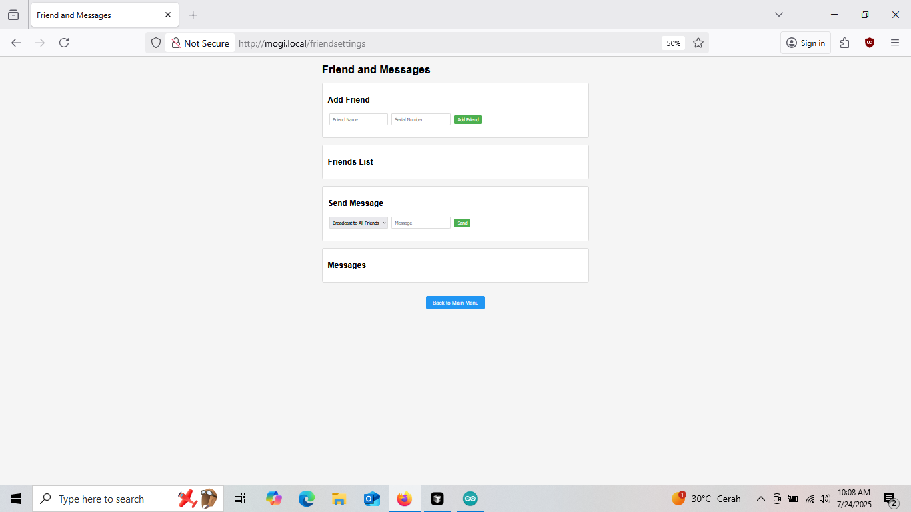

### 🎬 Video Demo Mogi Pet

[](https://youtube.com/shorts/MkC0C1nvI-Q)
[](https://www.youtube.com/watch?v=MkC0C1nvI-Q&autoplay=1)

# 🧠 New Mogi Server & Client

**Dibuat oleh: Andey Koiwai**

Proyek ini merupakan sistem komunikasi antara ESP32 (client) dan Flask server (Python) untuk memproses input audio dan menghasilkan respons berbasis AI menggunakan API dari **Google Gemini** dan **Groq**.

---

## 📁 Struktur Proyek

```
newmogiserver/
├── server/     # Aplikasi Flask (Python)
│   ├── NEWSERVER9.py
│   ├── requirements.txt
│   ├── .env.example
├── client/     # Firmware untuk ESP32
│   └── MOGI_V01_2804_2025_UPDATED.ino
```

---

## 🚀 Cara Menjalankan Server (Python/Flask)

### 1. Siapkan file `.env` di folder `server/`

```
GEMINI_API_KEY=isi_api_key_gemini_kamu
GROQ_API_KEY=isi_api_key_groq_kamu
```

### 2. Install dependensi

```bash
pip install -r requirements.txt
```

### 3. Jalankan server

```bash
cd server
python NEWSERVER9.py
```

Server akan aktif di: `http://0.0.0.0:8888`

> Pastikan port dan alamat IP sesuai dengan client ESP32.

---
Proyek ini menggunakan berbagai komponen untuk membuat sistem ESP32 S3 berbasis audio dan AI. Berikut daftar lengkap perangkat keras:
🧠 Komponen Utama dan 🛒 Produk yang Dijual:

Berikut adalah komponen dan paket yang saya jual untuk mendukung proyek Mogi dan robotik lainnya. Semua tersedia di Shopee!

## 🛒 Produk yang Dijual

Berikut komponen dan paket yang saya jual untuk mendukung proyek Mogi dan robotik lainnya. Semua tersedia di Shopee!

---

### 🎁 Paket Lengkap

- **Mogi 1 Set Komplit — Rp693.000**  
  [🛍️ Beli di Shopee](https://id.shp.ee/2Rjjf44)

---

### 🔌 Komponen Elektronik

- **PCB Modifikasi — Rp57.600**  
  [🛍️ Beli di Shopee](https://id.shp.ee/62QwaRH)

- **Pengisi Daya USB-C 2S Li-Ion (8.4V, 2A) — Rp20.000**  
  [🛍️ Beli di Shopee](https://id.shp.ee/8RfSoH6)

- **BMS 2S Balanced 20A — Rp28.800**  
  [🛍️ Beli di Shopee](https://id.shp.ee/VtpTVV9)

- **Step-down MP1584EN (Fix 5V) — Rp10.000**  
  [🛍️ Beli di Shopee](https://id.shp.ee/SeKhZQU)

---

### 🔋 Daya dan Motor

- **2x Baterai 18650 (2S, 7.4V) — Rp90.000**  
  [🛍️ Beli di Shopee](https://id.shp.ee/4xuLygX)

- **L298N Mini Motor Driver — Rp15.000**  
  [🛍️ Beli di Shopee](https://id.shp.ee/nmuyd1h)

- **2 Set Motor Gearbox N20 + Roda — Rp90.000**  
  [🛍️ Beli di Shopee](https://id.shp.ee/xnJPSey)

- **Servo SG90 — Rp28.800**  
  [🛍️ Beli di Shopee](https://id.shp.ee/nawvqaX)

---

### 🔭 Sensor dan Tampilan

- **GC9A01 (Layar Bundar SPI) — Rp72.000**  
  [🛍️ Beli di Shopee](https://id.shp.ee/2sP4phs)

- **VL53L0X (Sensor Jarak I2C) — Rp38.400**  
  [🛍️ Beli di Shopee](https://id.shp.ee/FcbxrhH)

- **MAX98357A (I2S Amplifier) — Rp48.000**  
  [🛍️ Beli di Shopee](https://id.shp.ee/FbnP6JJ)

- **Modul Mikrofon INMP441 (I2S) — Rp48.000**  
  [🛍️ Beli di Shopee](https://id.shp.ee/wpumiRi)

- **ESP32-S3 N16R8 — Rp135.000**  
  [🛍️ Beli di Shopee](https://id.shp.ee/4NPSa1j)

---

### Konfigurasi Penting dalam Kode:

```cpp
const char* server = "http://192.168.x.x:8888";
```

> Ganti dengan IP lokal tempat Flask server berjalan

ESP32 akan:

* Merekam suara melalui I2S
* Mengirim file WAV ke Flask server
* Menerima respon dari AI (Gemini/Groq)

---

## 🧠 Fitur Aplikasi Flask (Server)

* Menerima file audio `.wav` via POST request
* Mengubah audio menjadi teks dengan SpeechRecognition
* Menghasilkan balasan menggunakan Gemini atau Groq
* Menyimpan log, status, atau data interaksi ke TinyDB / JSON

---

## 🔐 Keamanan

* API key **tidak disimpan langsung** di file Python
* Menggunakan `os.environ.get()` untuk membaca dari environment
* File `.env` disertakan sebagai contoh, dan **tidak dipush ke GitHub**

---

## 📦 Dependensi Server

* Python 3.8+
* Flask
* gTTS
* SpeechRecognition
* tinydb
* requests
* google-generativeai
* python-dotenv

> Semua sudah didefinisikan di `requirements.txt`

---

## 🙋 FAQ

**Q: Apakah bisa jalan di Replit, Render, atau Koyeb?**
A: Bisa! Cukup upload `server/` ke repo GitHub, dan deploy dari sana. Tambahkan ENV `GEMINI_API_KEY` dan `GROQ_API_KEY` di dashboard platform tersebut.

**Q: Di mana file audio disimpan?**
A: Secara default di local storage server (`recording.wav`, `output.mp3`). Kamu bisa ubah ke penyimpanan eksternal seperti S3 jika di hosting.

---

## 🤝 Lisensi dan Donasi

Proyek ini **gratis digunakan untuk pembelajaran dan pengembangan**.
Jika kamu merasa proyek ini bermanfaat, kamu bisa memberi dukungan:

☕ Donasi melalui **transfer BCA**
No. Rekening: **5745008264**
Atas Nama: **Dewi Lestari**

📫 Hubungi via email jika ingin kolaborasi, kontribusi, atau konsultasi teknis.

**Copyright © 2025 Andey Koiwai.**

---

## 📬 Kontak

* GitHub: [@andeykoiwai](https://github.com/andeykoiwai)  
* Email: andeykoiwai@gmail.com  
* WhatsApp: +62 899 8210 011  
    
  [Klik untuk chat langsung](https://wa.me/628998210011)  
* Facebook: Takako Andey  
* TikTok: [@mogirobotic](https://www.tiktok.com/@mogirobotic)  
* YouTube: [@mogirobotik](https://www.youtube.com/@mogirobotik)

## 🖼️ Dokumentasi Visual

### 🔧 Skema Rangkaian (Fritzing)


---

### 🧰 Setting Arduino IDE



---

### 🌐 Tampilan Menu WebMogi







---

> Terima kasih sudah menggunakan New Mogi Server & Client! Semoga bermanfaat untuk riset, robotika, AI, atau proyek IoT kamu 🚀
